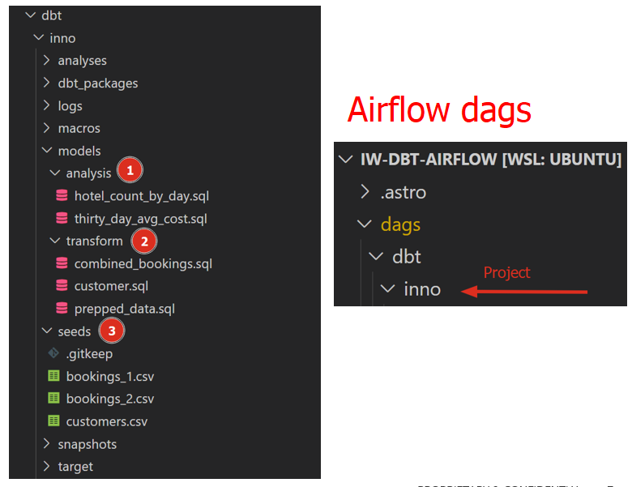

## Overview

Project Airflow with dbt to create scheduled data transformation jobs

Apache Airflow is an open-source workflow management platform that can be used to author and manage data pipelines. Airflow uses workflows made of directed acyclic graphs (DAGs) of tasks. The Astro CLI is a command line interface for Airflow developed by Astronomer. It's the easiest way to get started with running Apache Airflow locally

dbt is a modern data engineering framework maintained by dbt Labs that is becoming very popular in modern data architectures, leveraging cloud data platforms like Snowflake. dbt CLI is the command line interface for running dbt projects. The CLI is free to use and open source.

Cosmos is an Open-Source project that enables you to run your dbt Core projects as Apache Airflow DAGs and Task Groups with a few lines of code.


## Booking use case

Let's take some time to understand what we are going to do for our dbt project.

As can be seen in the diagram below, we have 3 csv files bookings_1, bookings_2 and customers . We are going to seed these csv files into Snowflake as tables. This will be detailed later.

Following this, we are going to use dbt to merge bookings_1 and bookings_2 tables into combined_bookings. Then, we are going to join the combined_bookings and customer table on customer_id to form the prepped_data table.

Finally, we are going to perform our analysis and transformation on the prepped_data by creating 2 views.

1. hotel_count_by_day.sql: This will create a hotel_count_by_day view in the ANALYSIS schema in which we will count the number of hotel bookings by day.

2. thirty_day_avg_cost.sql: This will create a thirty_day_avg_cost view in the ANALYSIS schema in which we will do a average cost of booking for the last 30 days.


## Setting Airflow Environment

Now going back to your Airflow directory, open up the requirements.txt file that the Astro CLI created. Copy and paste the following text block to install the Cosmos and Snowflake libraries for Airflow. Cosmos will be used to turn each dbt model into a task/task group complete with retries, alerting, etc.

```shell
astronomer-cosmos
apache-airflow-providers-snowflake
```

Next, open up the Dockerfile in your Airflow folder and copy and paste the following code block to overwrite your existing Dockerfile. These changes will create a virtual environment for dbt along with the adapter to connect to Snowflake. It's recommended to use a virtual environment because dbt and Airflow can have conflicting dependencies.

```shell
# syntax=quay.io/astronomer/airflow-extensions:latest

FROM quay.io/astronomer/astro-runtime:9.1.0-python-3.9-base

RUN python -m venv dbt_venv && source dbt_venv/bin/activate && pip install --no-cache-dir dbt-snowflake && deactivate
```

## Organizing Project

### Add dbt project inside Airflow Dags folder



### Building the dbt DAG


### Airflow UI / Cosmos parsing

