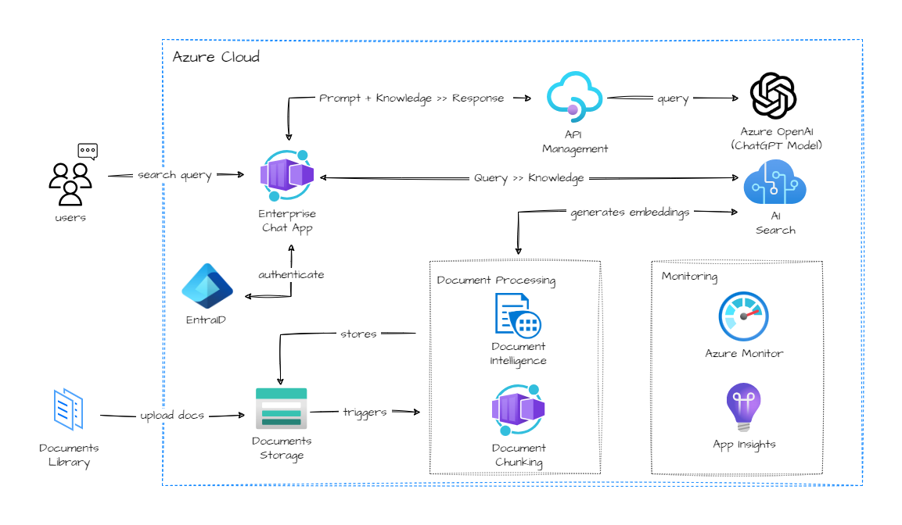

# Generative AI Architeture

[Official documentation]([https://aka.ms/aihub](https://azure.github.io/activate-genai/))

All **Activate GenAI with Azure** features are now part of the **[Azure AIHub project](https://aka.ms/aihub)** 

# Activate GenAI with Azure

This delivery guide will help you build a ChatGPT-like experiences over your Enterprise data using the Retrieval Augmented Generation pattern. 

Under the hood the solution uses Azure OpenAI Service to access the ChatGPT model (gpt-35-turbo), and Azure Cognitive Search for data indexing and retrieval.

For more information check **[Activate GenAI with Azure](https://azure.github.io/activate-genai)**.

## Contributing

This project welcomes contributions and suggestions.  Most contributions require you to agree to a
Contributor License Agreement (CLA) declaring that you have the right to, and actually do, grant us
the rights to use your contribution. For details, visit https://cla.opensource.microsoft.com.

When you submit a pull request, a CLA bot will automatically determine whether you need to provide
a CLA and decorate the PR appropriately (e.g., status check, comment). Simply follow the instructions
provided by the bot. You will only need to do this once across all repos using our CLA.

This project has adopted the [Microsoft Open Source Code of Conduct](https://opensource.microsoft.com/codeofconduct/).
For more information see the [Code of Conduct FAQ](https://opensource.microsoft.com/codeofconduct/faq/) or
contact [opencode@microsoft.com](mailto:opencode@microsoft.com) with any additional questions or comments.
