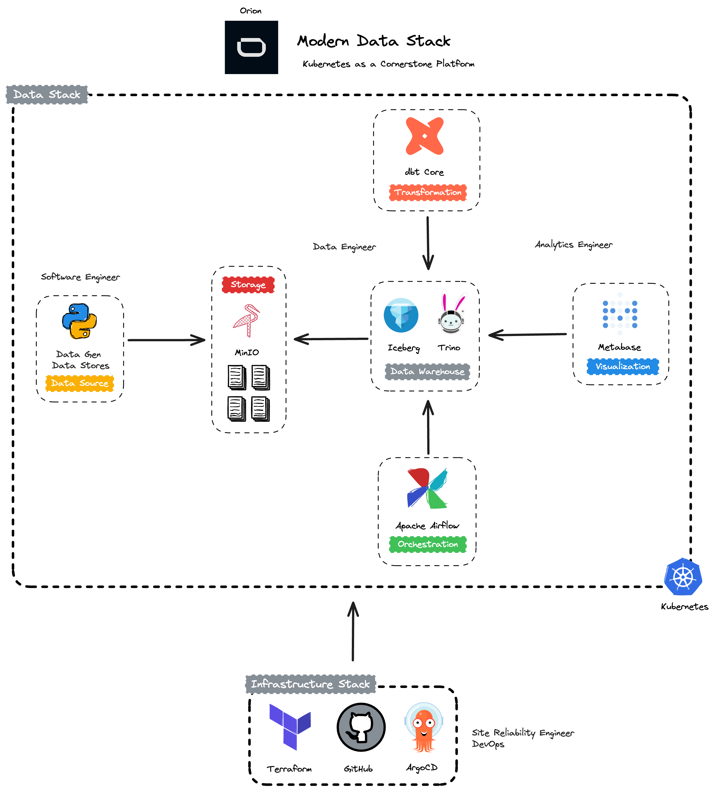
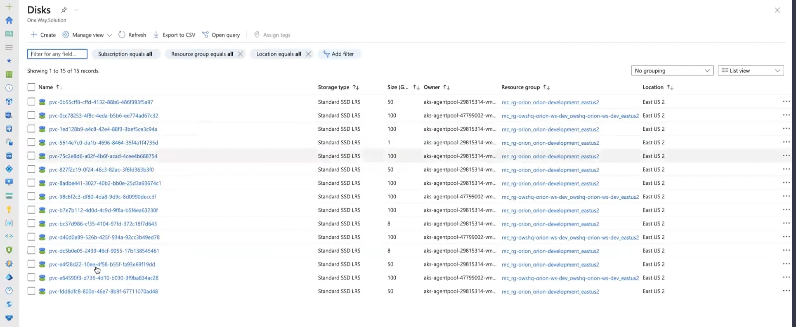
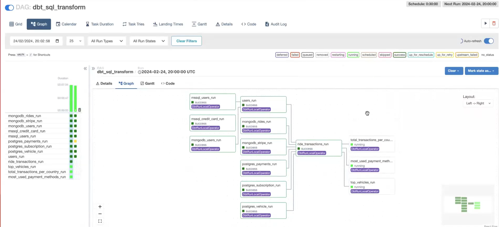
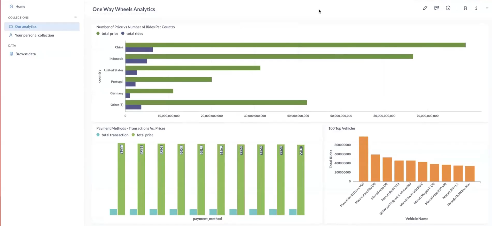

# Data in Kubernetes 
### Modern Data Stack

The main objective is to create a data environment in Kubernetes using the most famous open source data market products.

This project is structured in 3 parts:
- [infra](#infra)
- [apps](#apps)
- [data](#data-cluster)

### infra
All the resources needed to create a Kubernetes cluster as well as the necessary components
for the data environment using GitOps.

To deploy the environment, follow the steps:
1) [Kubernetes](https://github.com/Luis20matias/Data_engineer_projects/tree/main/modern-data-stack-k8s-master/infra/terraform/kubernetes/aks/modern-data-plataform-cluster/readme.md)
2) [GitOps](https://github.com/Luis20matias/Data_engineer_projects/tree/main/modern-data-stack-k8s-master/infra/terraform/gitops/argocd/readme.md)
3) [Deployment](https://github.com/owshq-academy/ws-stack-dados-k8s/blob/e6a934db161f71a691374bfd57192e7cad8d4a3b/infra/src/readme.md)

### apps
Development of an application that creates json or parquet files to place in the landing zone folder
of a data lake, in this case using MinIO (s3)

For the application, follow the steps:
1) [Data Gen DataStores](https://github.com/Luis20matias/Data_engineer_projects/blob/main/modern-data-stack-k8s-master/app/data-gen-datastores/readme.md)

### data
Creating a data pipeline using Apache Airflow, Trino & dbt-Core to create a data environment
complete end to end.

To build the data environment, follow the steps:
1) [Trino](https://github.com/Luis20matias/Data_engineer_projects/tree/main/modern-data-stack-k8s-master/data/sql)
2) [dbt_Core](https://github.com/Luis20matias/Data_engineer_projects/tree/main/modern-data-stack-k8s-master/data/dags/dbt/owshq)
3) [Apache Airflow](https://github.com/Luis20matias/Data_engineer_projects/blob/main/modern-data-stack-k8s-master/data/dags/dbt_sql_transform.py)

### links
- [Kubernetes](https://kubernetes.io/docs/home/)
- [Digital Ocean](https://www.digitalocean.com/)
- [HoneyPot Kubernetes Part 1](https://www.youtube.com/watch?v=BE77h7dmoQU)
- [HoneyPot Kubernetes Part 2](https://www.youtube.com/watch?v=318elIq37PE)
- [KubeCost](https://www.kubecost.com/)
- [AptKube](https://aptakube.com/)
- [ArgoCD](https://argoproj.github.io/argo-cd/)
- [MinIO](https://min.io/)
- [Trino](https://trino.io/)
- [Apache Iceberg](https://iceberg.apache.org/)
- [Trino & Iceberg](https://trino.io/docs/current/connector/iceberg.html)
- [dbt](https://www.getdbt.com/)
- [Apache Airflow](https://airflow.apache.org/)
- [OpenMetadata](https://open-metadata.org/)
- [Docker](https://www.docker.com/)
- [Terraform](https://www.terraform.io/)
- [Terragrunt](https://terragrunt.gruntwork.io/)
- [InfraCost](https://www.infracost.io/)
- [OpenTofu](https://opentofu.org/)
- [Helm](https://helm.sh/)
- [Kustomize](https://kustomize.io/)
- [Astronomer Cosmos](https://astronomer.github.io/astronomer-cosmos/index.html)

### Results

#### Sample of persistent volumes created on Azure

#### Airflow + dbt using Cosmos

#### Metabase Dashboard

