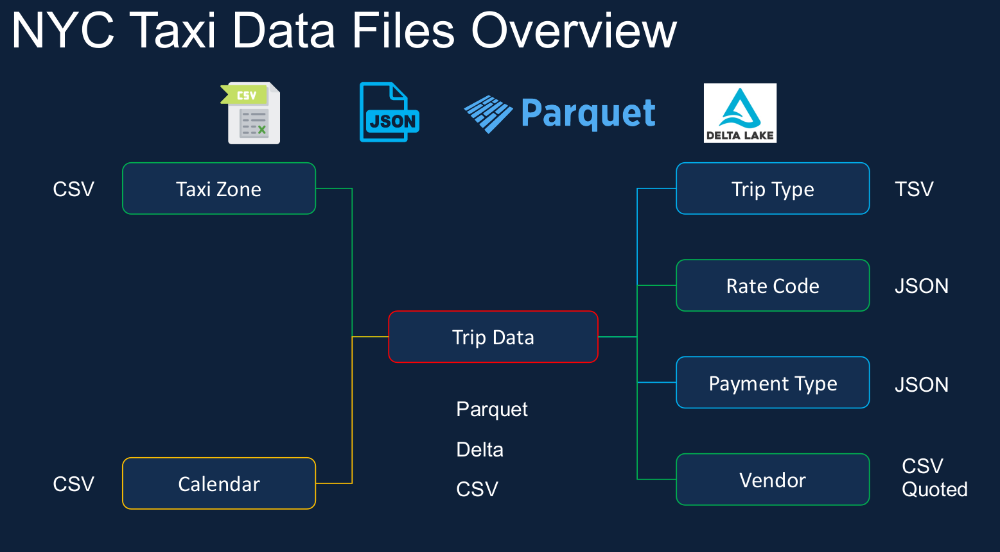
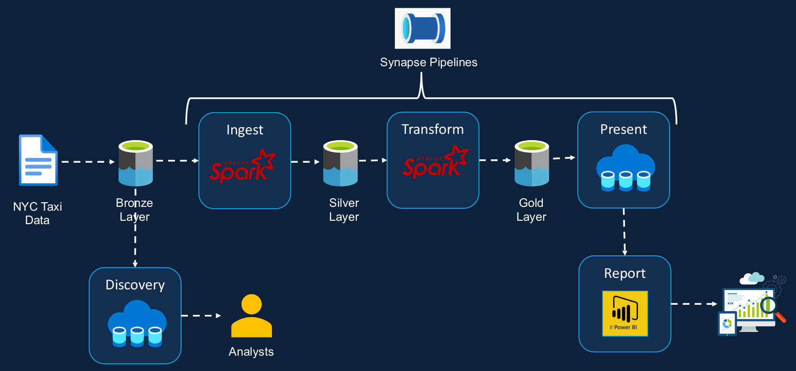
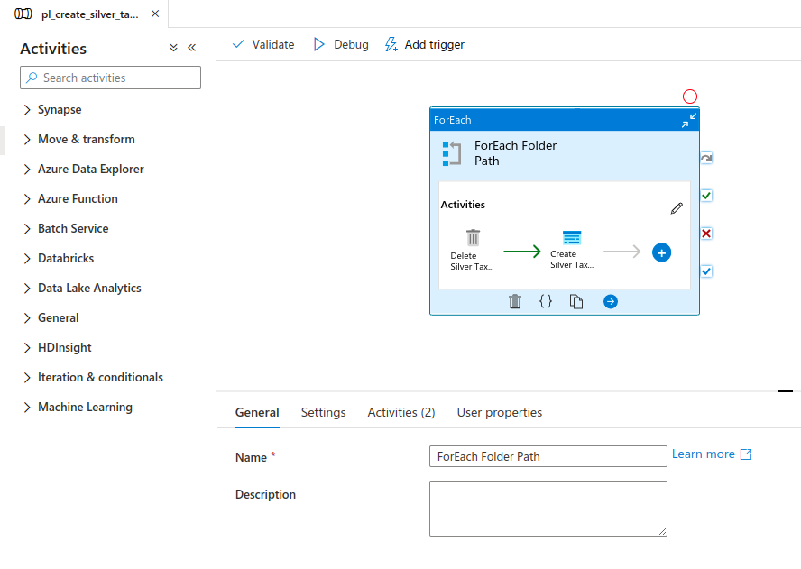
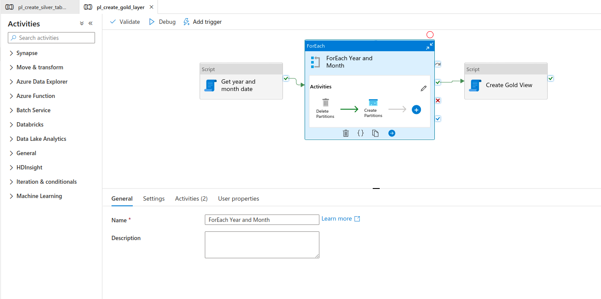
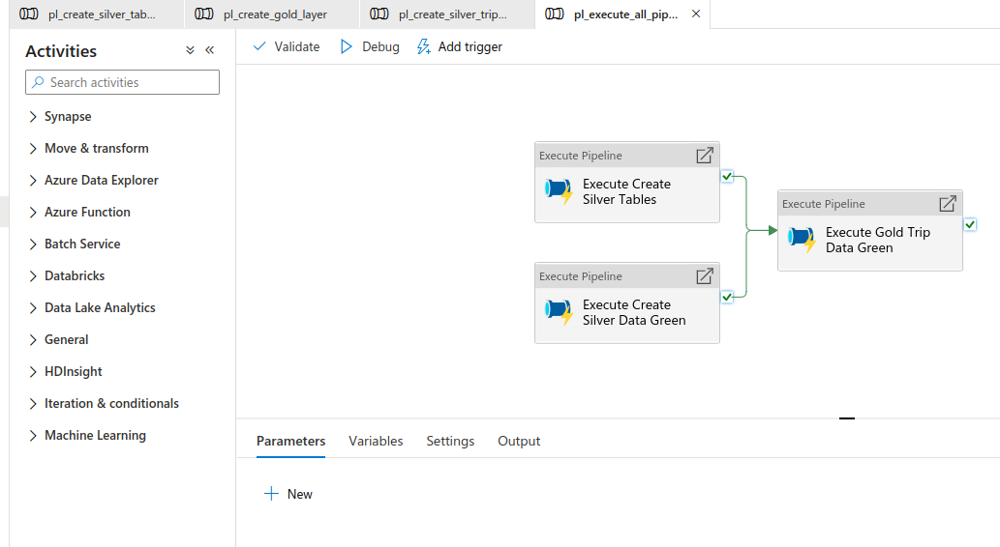

   

## Azure Synapses Analytics Project - NYC Taxi Trips data

Azure Synapse Analytics is a limitless analytics service that brings together
data integration, enterprise data warehousing and big data analytics.

## Requeriments 

* Data Discovery
  * Data exploration capability on the raw data
  * Schema applied to the raw data
  * Discovery using T-SQL
  * Discovery using pay-per-query model (Serveless SQL Pool)

* Data Ingestion 
  * Ingested data to be stored as Parquet
  * Ingested data to be stored as tables/ views
  * Ability to query the ingested data using SQL
  * Ingestion using pay-per-query model
  
* Data Transformation 
  * Join the key information required for reporting to
create a new table.
  * Join the key information required for Analysis to
create a new table.
  * Must be able to analyze the transformed data
via T-SQL
  * Transformed data must be stored in columnar
format (i.e., Parquet)

* Reporting Requeriments
  * Taxi Demand
  * Credit Card Campaign
  * Operational Reporting
  * Scheduled to run at regular interval
  * Ability to monitor pipelines
  * Ability to re-run failed pipelines
  * Ability to set-up alerts on failures

## Data Overview

A star schema is a multi-dimensional data model used to organize data in this project

 

## Solution Architecture – Serverless SQL Pool

 

## Pipelines

All the code needed to create the External tables, procedures, pipelines, notebooks and pipelines are in the folders above.

### Silver Layer

 

### Gold Layer

 

### Run all pipelines

 

